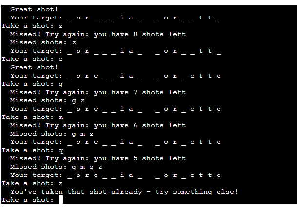

# Welcome to Star Wars Hangman! 

For project three I decided to develop a Star Wars version of the hangman game that is based on the films and TV shows, encompassing everything from the original trilogy to current day productions. I chose this because I enjoy word games and have been a Star Wars fan for as long as I can remember. This game brings both of those passions together and I have really enjoyed developing, testing and playing this game. 

## User Demographic
This game is aimed primarily at the following:
- people who enjoy Star Wars
- people who enjoy word games
- fans of pop culture
- anyone who wants to play a moderately challenging but not-too-taxing game on their phone during their commute, in their downtime, etc. 

## Purpose
The purpose of the game is:
- to test the player's depth of knowledge about Star Wars, from the well-known (Darth Vader and Grogu) to the obscure (the Jedi called Yaddle, or the bar-tender Wuher) to the very deep cuts (Falumpaset creatures or the planet Vandor)
- to offer the player a fun and relaxing pastime 

# What's so Star Wars-y about this game? 
- The answers are all taken from the so-called 'canon' Star Wars films and TV shows released by George Lucas and from the Disney Era
- The answer could be anything from the Star Wars universe: a character, droid, ship, vehicle, weapon, type of trooper (stormtrooper, dark trooper, clone trooper), creature, planet, place or an alien species
- I have tried to give the messages a 'Star Wars' flavour, e.g. 'starting your attack run ...' when starting a game, or 'Loading up the Death Star plans now ...' when the player chooses to view the gameplay instructions. 
- If I were to come back to this, I would try to implement some Ascii Art to illustrate the gameplay with Star Wars-style images, but I could not do that this time. 

# Hangman Rules and Variants
Although Hangman is a simple game to play, it is possible to add levels of difficulty. Do you, for example, strictly enforce a "10 attempt only" rule, including right and wrong guesses? In this scenario, the user has a strict number of attempts to get the answer, and each guess - right or wrong - uses up an attempt. Or do you allow the player to guess correctly without losing any attempts? This is the traditional Hangman gameplay, whereby no attempts are used up when the player guesses correctly; they only lose attempts for incorrect guesses.  

Although I originally planned to go for the strict '10 attempts only' option, I ended up developing the traditional gameplay with a couple of extra options to mix things up. The harder option could be added at a later date.

# Original Plan
Here is how I sketched out the game using Lucid Chart:

- Gameflow:

- Conditions:

- Conditions - work in progress:

# How the app works: overview

As things stand now: the app / game works as follows: 
- all data for the answers, clues 1 and 2 is stored in the same worksheet in a linked google spreadsheet 
- details for the leaderboard are exported to the same spreadsheet but in a different worksheet and can be added to / viewed within the terminal at the player's request 
- from the homescreen, the user can choose to play the game, view the leaderboard or read the rules by entering 1, 2 or 3 on their keyboard (no other options are allowed)
- if the player chooses 1, the gameplay starts 
- if the player chooses 2, they are shown a leaderboard with the player's name, the answer they guessed, and how many chances are left over (see 'leaderboard' section for clarification)
- if the player chooses option 3, they are directed to a screen that explains how the game works and walks them through the process, explaining the different functionalities I've built into the game
- after this, the player is directed to press the 'enter' key to start the game 
- the game immediately shows the player a name with all letters replaced with an underscore: _
- if there are any hyphens or apostrophes in the name, these are displayed, e.g.
_ - _ _ _ _  (x-wing)
or 
_ _ _ _ _ '_  _ _ _ _ _ _ (jabba's palace)
- if the target is made up of more than one word, any spaces between the words are also displayed as spaces, e.g. _ _ _ &nbsp; &nbsp; _ _ _ _ (han solo)
- depending on the length of the word, the user has either six or ten 'wrong' guesses: this is defined in the 'play_the_game' function, and is currently set as follows: 6 characters in the name or fewer = 6 wrong guesses, and 7 characters or more = 10 wrong guesses 
- the user can enter a single question mark (?) for clue number one, which tells them if it is a character, a ship, an alien species, a place, a planet, a weapon or a creature. 
- asking for clue 1 uses up one attempt.  
- the user can then enter two question marks (??) for a second clue which tells them in which set of films or TV series the answer comes from, e.g. The Original Trilogy, Rebels, Ahsoka, The Prequels and The Clone Wars, etc. 
- asking for clue 2 uses up one attempt.   
- in the normal gameplay, the user can only enter one character at a time
- if the player guesses correctly, no attempts are lost 
- if the player guesses incorrectly, one attempt is lost 
- the user can also make a guess at the whole answer by entering an ! which triggers the option 'guess the answer', e.g. 'x-wing' or 'jabba's palace'.
- if they are right, they win
- if they are wrong, they use up one attempt  
- as long as they guess the answer before they have used up all their wrong guesses, they win
- if not, they lose
- if the player wins, they can decide to add their game to the leaderboard if they want to

# App functionality: in depth

## Setting up the API to Google Drive

I closely followed the guidelines explained in the 'Love Sandwiches' walk-though project in order link the Google Doc to this game. Essentially I set up the link to Google Drive as follows: 
- go to Google Cloud Platform
- select project -> create new project -> name it: in this case, starwars-hangman-p3
- go to project page 
- API and services -> library -> enable Google Drive and Google Sheets 
- Set role as Editor
- Generate credentials -> manage account services -> Keys 
- Create JSON file with the private Key and download 
- I then enabled the API for Google sheets and downloaded the JSON file for that as well

## Adding and Sharing Credentials
Again, I followed the 'Love Sandwiches' walkthough here:
- I added the JSON files to my GitPod workspace 
- shared the client email with my data spreadsheet, and enabled function as editor 
- add creds.json to the git.ignore folder so that it would not be shared to github to ensure privacy. Here you can see that entering "git add and git status" reveals that the creds.json does not appear in the files to be committed (as per the Code Institute advice):

## The spreadsheet: starwars_hangman
This is a read-only link to the spreadsheet that I used for the game: https://docs.google.com/spreadsheets/d/1s2Sdv2Cj6v-hUnXD9Wr84nehteS9X3BuBctTleoWaK8/edit?usp=sharing

The set-up for a hangman game is fairly simple: 
- in the 'answers' sheet, there are three relevant columns: the answer, i.e. the target word that the player has to guess, then clue 1 and clue 2.  
- I populated this sheet myself: as a long-term fan, I enjoyed doing this! 
- this sheet simply supplies data to the game and is not updated by the game
- in the leaderboard sheet, there is the player's name which they enter in the terminal, the name they guessed and how many wrong attempts were remaining.
- I both call information from this sheet to display the leaderboard, and update it when the successful player chooses to do so. It is updated when the player chooses to add their name, and the .append method adds their name as well as the guessed answer and number of attempts to the worksheet. 

## Setting up access to the spreadsheet data

This section also closely follows the 'Love Sandwiches' walkthrough by adding the scope and credentials needed to access the spreadsheet, call data from it and pass data to it.  
 

As part of the set-up and deployment, I set up an API to access the Google Doc usinging the Google OAuth2 protocol

I imported the modules listed in the screenshot:
 
- gspread for accessing the Google Sheet
- random for choosing a cell at random in the Google Sheet
- OS to allow me to implement the 'clear screen' function for the homepage 
- credentials for accessing the linked spreadsheet 

## MyPrint

I created a 'myprint' function for the Heroku terminal rather than using the standard 'print' because I wanted to give the terminal a left margin. I the text in the Heroku terminal difficult to read with the standard 'print' function so added a basic left margin with a new 'myprint' function coded as follows: 

The top line of the terminal (which I cannot change) shows it without a left margin, followed by my game which is all added with a left margin: 

## How to play: explanation
This is a sequence of statements added with myprint to explain the gameplay. I thought it would be good practice to add this in, especially to clarify what kinds of things the answers might be, to ask for the two clues and how to guess the whole answer:

I added a 'clear screen' function here because I found the terminal too cramped when I went from the homescreen to the gameplay explanation. I used this solution from Stack Overflow which I used for the 'clear screen' - this is the source:
https://stackoverflow.com/questions/76955384/how-to-clear-the-screen-in-python-when-a-certain-condition-is-met-when-execution

## Importing and displaying the target and clues 

In this section, I import the target from the google sheet:

In my first tests of the game, I noticed that the capital letters I used while populating the spreadsheet were a problem, as were the occasional trailing spaces. Rather than edit the spreadsheet, I decided to eliminate both capitals and leading / trailing spaces by applying the lower and strip methods to the string.

I then applied the same approach to the imported clues:  

For my own sake, it took some mental processing to understand how to import the correct clues based on the answer, but the process works reliably. As I understand the get_clue functions and would explain them: 
- the first line of the function, starting with 'clue1_data', calls the information from the google doc
- for row in clue1 data: word = row[0]: this refers to the target word that I am importing from the google doc and displaying the to player as underscores
- this 'word' has to be the same as the 'answer' parameter which is shown in parentheses = the target word which is shown to the player as underscores 
- as these have to be the same, row [1] (for Clue 1) has to refer to Clue1 in the linked spreadsheet, and row[2] has to refer to Clue2
- simply put: Python starts reading spreadsheets from row 0, so colum A = row 0, column B = row 1, and so on:

I cover the functionality around calling the clues in the 'Clues' section of this ReadMe below. 

## Setting up the game 
In this section I define some of the main variables for playing the game:

Some clarifications: 
- Spaces, apostrophes and hyphens. I wanted to display hyphens, apostrophes and spaces as they are, rather than hidden by underscores. I thought that asking the player to guess hyphens and apostrohes a little unfair, and would be inaccurate to some of the source material - I didn't want to display x wing or xwing which it is correctly x-wing. Additionally, showing spaces between words seemed only fair, which is why I added these three exceptions to the rule which hides all characters by underscores. 

- Guessed characters: I did not want to penalise the player who repeated a guess by mistake, so this variable keeps track of what they have guessed - correctly or incorrectly - and gives them a reminder in this case; additionally, they do not lose any attempts for repeated guesses. 
In this example, the player enters the letter Z twice, and gets the reminder on the second attempt:

- Wrong guesses: to help the player keep track of where they are in the game, I use this variable to monitor their wrong guesses so I can display them to the player. I considered adding all guesses to this list, but as the correctly-guessed characters appear in the target word(s), this seemed redundant. 

- Invalid characters: it would be easy to lose an attempt by accidently entering an apostrophe, hash sign or asterisk, so I have excluded them where; if the user enters an invalid character, they get a warning message but they do not lose an attempt. 

This is the code that displays the corresponding error message: 

- Clue1 and Clue 2: as Clue 1 is more general and Clue 2 more specific, I wanted to ensure that the player cannot ask for Clue 2 before Clue 1. Therefore I have set their default setting to 'False', and this becomes 'True' only when they have been called. This also facilitates the option to display the same clue a second or third time without the player losing an attempt (see 'Clue' section below)

## Number of attempts

I decided to implement a variable that allows the owner of the game to adapt the number of wrong guesses allowed per game. This is based on the length of the word: some names are very short, e.g. Rey, R2-D2, but I didn't want to exclude them as possible target answers. Equally, it seemed a bit unfair to have 10 attempts for a three-letter word as for something like 'Salacious B Crumb', which is why I added this variable.  

Having said that, some of the shorter words are more difficult to guess as there are fewer cues to rely on to get them right, but I think on balance it is fair to get fewer attempts for much shorter words.  

This could be adapted into a future iteration of the game, allowing the player to decide between easy, standard and hard difficulty levels based on the number of guesses, but I could not implement this at this stage.  

This returns me to a question I asked in the 'summary' of 'How the app works': what does an attempt mean? Does the player get 10 attempts in total, regardless if whether the guess is right or wrong, or does 10 attempts mean 10 wrong attempts? In the context of hangman, an attempt means a wrong guess, and so that is what it means here. But if I were to take this game any further, I would develop the naming coventions a little more to ensure 100% transparency.  

## Guess whole answer
As the rules of Hangman only allow one character at a time but also for the user to guess the whole answer, I needed a way to make both options acceptable. I enabled this function by allowing the user to enter a single exclamation mark (!) as a trigger to show the "Guess whole answer" input:

This allows me to enforce the 'one-character-at-a-time' Hangman rule, but also allows the player to guess the whole answer in one go.  

## Clues

As the Star Wars universe is quite vast, and the types of answers could include anything form planets to characters to creatures to spaceships, I decided to implement a 'get a clue' function: 
- clue 1 tells the player what the target is: whether it is a spaceship, character etc
- clue 2 tells the player in what series of films or TV shows the answer is most commonly found, e.g. The Original Trilogy, The Mandalorian, Kenobi, etc; if the answer is found in more than one series, the clue will show multiple sources, e.g. The Prequels and The Clone Wars, or Rebels, Ahsoka and The Mandalorian.  
- each clue uses up one attempt 
- the player cannot get clue 2 until they have asked for clue 1: if they try, they get an error message but do not lose any attempts.

- if the player repeats a request for a clue, they do not lose any attempts. I found during testing that I would sometimes accidently enter ? rather than ?? when asking for clue 2, which is why I implemented this safety-net.

## Standard gameplay: 1 character only
In order to enforce the Hangman rule of 1 character per guess, I wrote this code to check the length of the input; with the exception of entering two question marks for clue 2, this returns an error message if the player enters multiple characters. Additionally, it disables the possibility that the user enters a blank string by hitting the enter key; this issue with the enter key was a problem that I resolved with the help of my tutor, as I found it difficult to describe exactly what the enter key did, and therefore how to exclude it. But now if you hit enter without any actual input, you are shown 'invalid attempt.'  

## Standard gameplay: correct and incorrect guesses 
Having covered the exceptions to the rules, we now come to the standard gameplay section. This is the code which governs what happens when the player guesses a single character:

If the guess is correct, each instance of its appearance in the word will be populated.
If the guess is incorrect, the the number of attempts is reduced by one, the guess is entered to the 'wrong guesses' list, and the user is told (i) the guess was wrong and (ii) how many attempts they have left.  

## End of game: win or lose
The functionality at the end of the game is basically the same regardless of whether the player wins or loses, with a couple of divergences:
- Player wins

The approach is nearly identical for instances where the player guesses the whole answer, with just a slight change in wording.  

- Player loses

- in each case, the player is referred to the fan wiki "Wookipedia" to either find out more (if they won) or look up the answer (if they lost)
- in both cases, they can either play again or return to the homepage
- if the player loses, they can look at the leaderboard but not update it
- if the player wins, they can update the leaderboard; if they choose this option, it triggers an input field so they can enter their name. After that, they will be shown the leaderboad where they can see the answer they guessed, and how many attempts were remaining when they won.

## The Leaderboard 
This was the last feature of the app I put together. I created it for two reasons: 
- It's a good gameplay feature to include 
- I also wanted to practise exporting the results to an external spreadsheet as this is a common real-life request when, e.g. tracking sales, customer contacts etc.  

Here are the two functions: 

As indicated in my comments in the code, the 'leaderboard_page' calls the relevant information stored in the spreadsheet and prints the name, guessed word and number of remaining attempts.  The 'update_leaderboard' updates a new row of the worksheet with the player's name (inputted by the player themself), the guessed word and the number of remaining attempts.  

A note on the 'remaining attempts' column: the higher the number, the better you have done. This counts the number of remaining 'incorrect guesses' the player had when they solved the answer. 

If I were to work on this more, I would
- count the number of total guesses, correct and incorrect
- number of available attempts, so instances of games in which only 6 attempts are allowed could be separated out from those in which 10 are allowed.  

# Testing

These tests were conducted within the GitPod terminal and in the Heroku terminal.

| Test                                              | Expected outcome                                    | Result |
| ------------------------------------------------- | --------------------------------------------------- | ------ |	
|All pages: a custom 'myprint' version of 'print' displays all 'print' messages in the app  | lines are displayed in the Heroku Terminal with a slight left margin for readability | Pass   | 
|Homepage: type 1 and press enter                    | Loads and displays the game with message "Starting your attack run"	        | Pass   | 
|Homepage: type 2 and press enter                    | Loads and displays the leaderboard   	        | Pass  |
|Homepage: type 3 and press enter                    | Loads and displays the gameplay explanation   	        | Pass  |
|Homepage: enter any other characters than 1, 2 or 3     | Loads error message: 'No target found: please enter 1, 2 or 3'          | Pass   |    
|Homepage: error message after anything other than 1, 2 or 3 is entered    | Input field for options 1, 2 or 3 is visible and usable          | Pass   |    
|From homepage to gameplay page           | A single word - the 'target word' - is called at random from the linked Google doc 'answer' column  | Pass   |   	
|Gameplay page loads the 'target' word(s) | The target word is displayed with 'Your target:'       | Pass |
|Gameplay page loads the 'target' word(s) | All characters are hidden with underscores except for hyphens and apostrophes       | Pass | 
|Gameplay page loads the 'target' word(s) | Hyphens and apostrophes are displayed appropriately      | Pass | 
|Gameplay page loads the 'target' word(s) | Spaces between words are shown as spaces, not as underscores      | Pass | 
|Gameplay page loads the 'target' word(s) | The player is shown how many number of wrong guesses ('shots') they are allowed  | Pass |
|If the target word has 6 or fewer characters: | The user is told they have 6 wrong guesses ('shots') | Pass |
|If the target word has 7 or more characters: | The user is told they have 10 wrong guesses ('shots') | Pass |
|The values for length of word vs number of available guesses: | Changes to the variables in the code are reflected in the game   | Pass |
|Gameplay: the player enters a correct character: | Each instance of that character in the target is populated, 'Great shot' message shown | Pass |
|Gameplay: the player enters an incorrect character: | 'Missed' message is shown, the list of incorrect characters so far entered is shown | Pass |
|Gameplay: the player enters an incorrect character: | One attempt is lost, user us shown how many remaining attempts there are | Pass |
|Gameplay: the player tries to repeat a character they have already used, correctly or incorrectly: | 'Reminder' message is shown, user prompted to try something else | Pass |
|Gameplay: the player tries to repeat a character they have already used, correctly or incorrectly: | No attempts are lost | Pass |
|Gameplay: the player enters more than one character with exception of ??: | Error message is shown, no attempts are lost | Pass |
|Gameplay: the player enters more than one character with exception of ??: | User is reminded that they should enter ! to guess the whole answer | Pass |
|Gameplay: the player enters ! | The player is prompted to guess the entire answer | Pass |
|Gameplay: the player guesses the whole answer correctly | The game ends, user is congratulated | Pass |
|Gameplay: the player guesses the whole answer correctly | Link to Wookiepedia is shown | Pass |
|Gameplay: the player guesses the whole answer correctly | The player has options to play again, add their game to the leaderboard, or go to homepage | Pass |
|Gameplay: the player guesses the whole answer correctly and chooses to add game to leaderboard | A usable input field for their name is shown | Pass |
|Gameplay: the player guesses the whole answer correctly and chooses to add game to leaderboard | Name, guessed word and number of remaining wrong guesses are shown | Pass |
|Gameplay: the player guesses the whole answer correctly and chooses to add game to leaderboard | All details appear in the linked spreadsheet in the appropriate worksheet | Pass |
|Gameplay: the player guesses the whole answer incorrectly | The player is shown what they entered: they lose an attempt | Pass |
|Gameplay: the player guesses the whole answer incorrectly | The player can carry on playing unless they are out of chances | Pass |
|Gameplay: the player enters ? | Clue number 1 is called from the correct cell in the google sheet 'Clue 1' column and displayed the the user  | Pass |
|Gameplay: the player enters ? | An attempt is used up  | Pass |
|Gameplay: the player enters ?? | Clue number 2 is called from the correct cell in the google sheet 'Clue 2' column and displayed the the user  | Pass |
|Gameplay: the player enters ?? | An attempt is used up  | Pass |
|Gameplay: the player tries to call Clue 2 before Clue 1 | Error message is shown, player is prompted to call clue 1 first; no attempts are lost | Pass |
|Gameplay: the player enters any of the characters defined in the invalid_characters variable | An error message is shown, no attempts are lost  | Pass |
|Gameplay: the player tries to guess the whole answer at the start of the game before guessing any individual characters | The 'guess whole answer' prompt is correctly displayed and the function works correctly as described above | Pass |
|Gameplay: the player asks for Clue 1 at the start of the game before guessing any individual characters | Clue 1 is correctly displayed and the function works correctly as described above | Pass |
|Gameplay: the player can ask for Clue 1 and then guess the whole answer without guessing an individual character | Clue 1 functionality and Guess Whole Answer functionality work correctly as described above | Pass |
|Gameplay: the player can ask for Clue 1, Clue 2 and then guess the whole answer without guessing an individual character | Clue 1 and 2 functionality and Guess Whole Answer functionality work correctly as described above | Pass |
|Gameplay: the player can complete the game without asking for a clue or trying to guess the whole answer  | Standard gameplay functionality works as described above | Pass |
|Gameplay: each incorrect attempt and Clue reduces the number of available attempts by 1 until none are left | Player loses and is told they have lost against the Death Start  | Pass |
|Gameplay: player loses | Player is shown the correct answer and prompted to look it up on Wookiepedia | Pass |
|Gameplay: player loses | The player has options to play again, view the leaderboard, or go to homepage | Pass |
|Gameplay: player loses | All three options work | Pass |
|Gameplay: player wins | Player is congratulated and told they have won | Pass |
|Gameplay: player wins | Player is asked if they would like to find out more on Wookiepedia | Pass |
|Gameplay: player wins | The player has options to play again, add their game to the leaderboard, or go to homepage | Pass |
|Gameplay: player wins | Links to play again and homepage work | Pass |
|Gameplay: player wins and chooses to add their game to the leaderboard | A usable input field for their name is shown | Pass |
|Gameplay:  player wins | Name, guessed word and number of remaining wrong guesses are shown | Pass |
|Gameplay:  player wins | All details appear in the linked spreadsheet in the appropriate worksheet | Pass 
|Leaderboard: | Links to play again or homepage are shown and work | Pass 

## Bugs

I encountered many bugs during the development of this game. The majority of them were to do with the implementation of the game logic, particularly when I added new features which led to old features being moved further down or up the code, or simply that the new feature was not optimally placed to make it work. A few of the more notable ones are listed here. 

- Homepage. When I first set up the homepage, I neglected to restore the input field when the user entered anything other than the permitted characters:

I fixed this by framing the options in a while-loop in order to keep the input field alive until the user entered a valid input. Before I added the loop, the code did not allow for the input field to be shown after an invalid entry: 

- Clues. The clues were in fact the part I found the most difficult to set up, and hence were the most buggy; part of this was due to coding inexperience, and part of it was due to poor coding logic.

- This bug was due to code inexperience: when I first set up the code, it turned out that I was describing the function rather than calling it. My tutor pointed this out during one of our meetings and I could fix it by calling it, i.e. "get_clue1()" rather than so "get_clue1". A simple fix, but one I needed help with.

- I had another issue with the code logic that meant no attempts were lost when I called the clues

The problem was to do with my order of operations. Originally I was providing the clue before decrementing the number of attempts:

So simply swapping the order around so that after the user asked for the clue, I first decremented the number of attempts and then gave the clue was the fix that was needed.

- Faulty order of operations was also the reason why, in the first deloyment of my Clue 2 code, 

I clear this up by simply moving the multiple characters check to follow the ?? input, and it worked fine.  

- Input from the enter key. I noticed during testing that, if I pressed the enter key on its own without any extra input, it would use up an attempt. I did not understand that pressing the enter key enters an empty string. With the help of my tutor, I adjusted the following code that I originally designed to stop the users from entering more than one character at a time. Before the fix I had this:

As we discussed during our meeting, my tutor pointed out that I was focusing on what I wanted to stop the player from doing, rather than what I wanted them to do. So in the fix, the code tells the player to enter one character, rather than not to enter more than one character

- The final bug was to do with my attempt to concatenate a long line of code in order for it to fit the Pep8 Linter. After splittling the relevant line of code so it conformed to the character limit per line, I could not longer access the information in the leaderboard table:

I had split the code as follows:

As you can see, I did not properly end each line of the string. This was then the fix:

## Pep8 Validation
The code passes Pep8 validation checked on this this website: https://pep8ci.herokuapp.com/

I had to use an extra solution for the leaderboard page which had one very long string that runs over three lines, but this was accepted by the CI Python Linter and is functional in the game, so it seems like a good solution:
https://stackoverflow.com/questions/1874592/how-to-write-very-long-string-that-conforms-with-pep8-and-prevent-e501

Final PEP8 validation feedback: all clear (23.03.2024  17:43):

## Future development
- In terms of coding: there are definitely places where I could consolidate my code to avoid repitition. For example, it would be possible to merge the code for Clue1 and Clue2, and I think the code for the end-game screen could be consolidated to help maintainability. This would be my priority if I come back to this game.   
- In terms of gameplay, the next step would be to add difficulty levels, with the hardest being limiting the player to a total number of correct and incorrect guesses, rather than, as here, a situation in which correct guesses are not counted. This would make the game more challenging. 
- I would like to update the leaderboard to count the total number of guesses per successful game, as well as the 'remaining attempts' (i.e. remaining wrong guesses) which is currently counted.
- I would also specify how many attempts were available to the player, e.g. was it a game with 10 available attempts, or just 6
- I would also like to export the information for all completed games, successful or unsuccessful, as this is a likely 'real-life' feature that would be desirable, if not necessary 
- Cosmetically, some Ascii Art would be desirable
- Additionally, I would set up a 'myinput' function to add a left margin to the input commands as well as the myprint statements. 
- If this were to be developed in much futher depth, a difficulty weighting could be developed whereby a name like Darth Vador would have a difficulty weighting of 1, i.e. the easiest, and Kleya Marki a difficulty level of 10, i.e. the most difficult. Collecting this data and weighting it would be a substantial project in itself, and probably not possible without access to commercial / propietory databases, but it would be a nice way to enhance the leaderboard, with obscure answers guessed in minimal number of total attempts getting maximum points. 

# Deployment to Heroku
I deployed to Heroku on 7th March 2024, i.e. as soon as possible during the development of this game. I did this following much of the advice and feedback I saw in the Slack communitiy as well as the official guidance. Since then, I have been testing the app in both the GitPod terminal and Heroku. As with the API, I followed the advice in the LoveSandwiches project step-by-step to ensure a successful deployment. The key steps were:
- set up my Heroku account
- connected GitHub to Heroku
- supplied my payment details and and school details (the Code Institute)
- created my app
- filled out the settings tab starting with the Config Vars (environment variables)
- copied the creds.json file and added it to the CREDS variable
- added Python and node.js buildpacks, ensured they were in this order
- added PORT 8000 to the Config Var in Heroku's settings 
- chose GitHub as my deployment method and connected to it
- connected my Heroku app to my GitHub repository
- I chose to activate automatic deploys as I had gone over this process in the walk-through project and was happy with it
- activated Eco Dynos

# Credits

As usual, my tutor Dick Vlaanderen was a great help: he was very patient, very clear, and steered me in the right direction. The tutoring team helped me with some of the issues I faced with this project and I relied on their advice from conversations I had even during Project 2, as it was still relevant.  Big thanks to them all.

# Sources
I relied heavily on the Code Institute's Python tutorials and the 'Love Sandwiches' walk-through project as I was a complete beginner with Python. 

I also found Eric Matthes (2023) "Python Crash Course: Third Edition" very helpful. 

These are some of the main online sources I used during the development of this game: 

- https://www.freecodecamp.org/news/how-to-strip-trailing-whitespace-in-python/#:~:text=To%20trim%20a%20string%20and,by%20default%2C%20will%20remove%20it.
- https://medium.com/@smhashirashfaq/how-to-create-your-own-hang-man-game-using-python-e93f2686b33d#:~:text=You%20can%20add%20as%20many%20words%20as%20you%20want%20to%20the%20list.&text=Using%20the%20random%20library%2C%20we,from%20the%20list%20of%20words.&text=Now%2C%20we%20will%20create%20a,the%20word%20from%20the%20player.
- https://stackoverflow.com/questions/70642903/python-hangman-horizontal-letter-view
- https://stackoverflow.com/questions/74424323/how-to-change-the-underscores-to-letters-in-python-hangman
- https://stackoverflow.com/questions/19760161/how-to-hide-reveal-letters-in-python-game
- https://realpython.com/inner-functions-what-are-they-good-for/#:~:text=If%20you%20define%20a%20function,define%20in%20the%20enclosing%20function.
- https://stackoverflow.com/questions/52045352/how-to-choose-random-word-in-python-from-a-list-of-words?rq=3
- https://stackoverflow.com/questions/55325444/retrieving-a-random-word-from-a-textfile
- https://stackoverflow.com/questions/21031592/importing-function-in-python
- https://codereview.stackexchange.com/questions/262813/python-text-based-hangman-game
- https://stackoverflow.com/questions/26410531/how-to-allow-the-user-to-add-words-to-the-hangman-game
- https://stackoverflow.com/questions/13452410/creating-hyperlinks-in-python
- https://medium.com/codex/decoding-python-functions-default-positional-and-keyword-arguments-2059423c3981#:~:text=The%20*%20before%20the%20parameter%20name,you%20use%20*%20before%20the%20name
- https://stackoverflow.com/questions/5813311/whats-the-significance-of-the-no-newline-at-end-of-file-log
- https://peps.python.org/pep-0008/#:~:text=The%20preferred%20way%20of%20wrapping,a%20backslash%20for%20line%20continuation
- https://ioflood.com/blog/python-concatenate-strings/#:~:text=The%20simplest%20way%20to%20concatenate,str1%20%2B%20'%20'%20%2B%20str2%20.&text=In%20this%20example%2C%20we've,new%20string%20'Hello%20World'